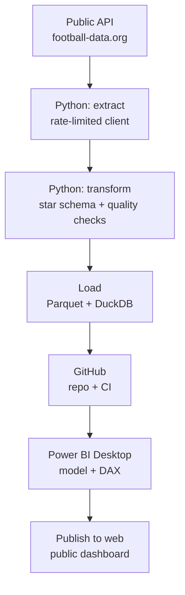
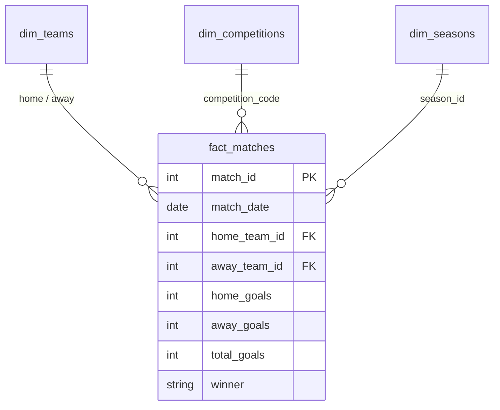

# Football Analytics Pipeline

An end-to-end, reproducible data pipeline that ingests match data from a public
API, models it into a star schema, and serves it to Power BI — built to
demonstrate analytics-engineering practice (ELT, dimensional modelling, data
quality, reproducibility).

> Data source: [football-data.org](https://www.football-data.org/) v4 API (free tier).

## Architecture



The pipeline is split into three single-responsibility layers — `extract`,
`transform`, `load` — so each can be tested and reasoned about in isolation.

## Data model

A small star schema: one fact table, three dimensions.



## Tech stack

| Layer        | Tool                          |
|--------------|-------------------------------|
| Ingestion    | Python, `requests`            |
| Transform    | `pandas`                      |
| Storage      | Parquet (`pyarrow`), DuckDB   |
| Testing      | `pytest`                      |
| Visualisation| Power BI                      |

## Project structure

```
football-analytics-pipeline/
├── config.py              # competitions, seasons, paths, rate limit
├── pipeline.py            # orchestration: extract -> transform -> load
├── src/
│   ├── extract.py         # rate-limited API client
│   ├── transform.py       # build star schema + data-quality checks
│   └── load.py            # write Parquet / build DuckDB
├── tests/
│   └── test_transform.py  # runs offline on sample data
└── data/
    ├── raw/               # raw API dumps (sample committed)
    └── processed/         # Parquet + DuckDB outputs
```

## Quickstart

```bash
# 1. Clone and enter
git clone <your-repo-url> && cd football-analytics-pipeline

# 2. Create a virtual environment and install
python -m venv .venv && source .venv/bin/activate   # Windows: .venv\Scripts\activate
pip install -r requirements.txt

# 3. Add your API token
cp .env.example .env        # then paste your football-data.org token

# 4. Run the pipeline
python pipeline.py          # pulls live data and builds the outputs
```

No token yet? Rebuild everything from the committed sample with no network:

```bash
python pipeline.py --offline
pytest -q
```

## Connecting Power BI

Two zero-cost options:

1. **Local file** — In Power BI Desktop: *Get Data → Parquet* and point at
   `data/processed/fact_matches.parquet`. Repeat for the dimension tables, then
   wire the relationships on the `*_id` keys.
2. **Straight from GitHub** — *Get Data → Web* and paste the raw URL of a
   committed Parquet file
   (`https://raw.githubusercontent.com/<user>/<repo>/main/data/processed/fact_matches.parquet`).
   The report refreshes whenever the pipeline pushes new data.

Once the report is built, *File → Publish to web (public)* gives a shareable
link for your portfolio. Use it only for this public football data.

## Roadmap

- [x] **Iteration 1 (MVP):** API → Python → Parquet/DuckDB → Power BI
- [ ] **Iteration 2:** replace pandas transforms with a `dbt-duckdb` project
      (staging → marts layers, `unique` / `not_null` / `relationships` tests,
      auto-generated docs)
- [ ] **Iteration 3:** scheduled refresh via GitHub Actions; add more
      competitions and a multi-season trend view

## License

MIT
