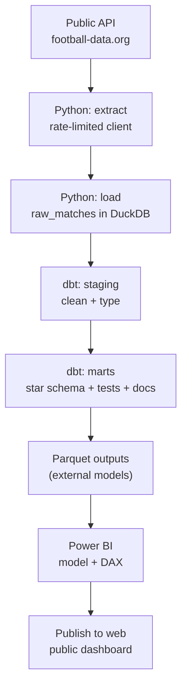
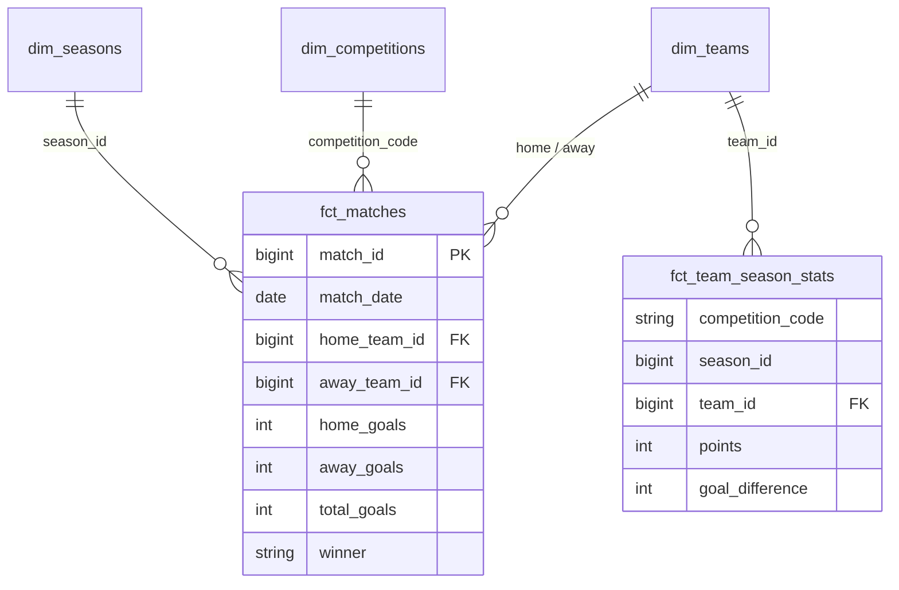

# Football Analytics Pipeline

An end-to-end, reproducible **ELT** pipeline that ingests match data from a
public API, lands it in DuckDB, and models it into a tested star schema with
**dbt** — built to demonstrate analytics-engineering practice (ELT, dimensional
modelling, data quality testing, documentation, reproducibility).

> Data source: [football-data.org](https://www.football-data.org/) v4 API (free tier).

## Architecture



The split is deliberate: **Python only Extracts and Loads** the raw data, and
**dbt does all Transformation in SQL**. That is the ELT pattern — the same shape
a production analytics-engineering stack uses, scaled down to run free on a
laptop.

## Data model

A star schema plus an aggregate fact, all built and tested by dbt.



`fct_team_season_stats` is a league-table style aggregate: points, wins/draws/
losses and goal difference per team, per competition, per season.

## Tech stack

| Layer        | Tool                          |
|--------------|-------------------------------|
| Extract      | Python, `requests`            |
| Load         | DuckDB (`raw_matches`)        |
| Transform    | **dbt** (`dbt-duckdb`)        |
| Testing      | `pytest` (EL) + dbt data tests|
| Serving      | Parquet -> Power BI           |

## Project structure

```
football-analytics-pipeline/
├── config.py              # competitions, seasons, paths, rate limit
├── pipeline.py            # EL: extract -> load raw_matches into DuckDB
├── src/
│   ├── extract.py         # rate-limited API client
│   ├── transform.py       # flatten nested JSON -> flat raw table
│   └── load.py            # write raw_matches into DuckDB
├── football_dbt/          # dbt project (the "T")
│   ├── dbt_project.yml
│   ├── profiles.yml       # local profile, points at the DuckDB file
│   └── models/
│       ├── staging/       # stg_matches (clean + type) + source/tests
│       └── marts/         # dim_*, fct_matches, fct_team_season_stats + tests
├── tests/
│   └── test_transform.py  # runs offline on sample data
└── data/
    ├── raw/               # raw API dumps (sample committed)
    └── processed/         # DuckDB + Parquet marts
```

## Quickstart

```bash
# 1. Clone and enter
git clone <your-repo-url> && cd football-analytics-pipeline

# 2. Create a virtual environment and install
python -m venv .venv && source .venv/bin/activate   # Windows: .venv\Scripts\activate
pip install -r requirements.txt

# 3. Add your API token
cp .env.example .env        # then paste your football-data.org token

# 4. Extract + Load: pull data and land it in DuckDB
python pipeline.py

# 5. Transform: build and test the models with dbt
cd football_dbt
dbt build --profiles-dir .          # staging -> marts + run all tests
dbt docs generate --profiles-dir .  # build the documentation site
dbt docs serve --profiles-dir .     # open the docs in your browser (optional)
```

No token yet? Rebuild everything from the committed sample with no network:

```bash
python pipeline.py --offline
pytest -q
cd football_dbt && dbt build --profiles-dir .
```

## Connecting Power BI

The marts are written as Parquet, which Power BI reads natively. Two options:

1. **Local file** — *Get Data -> Parquet* and point at
   `data/processed/fct_matches.parquet` (and the other marts), then wire the
   relationships on the `*_id` keys.
2. **Straight from GitHub** — *Get Data -> Web* and paste the raw URL of a
   committed Parquet file.

Then *File -> Publish to web (public)* gives a shareable link for your portfolio.

## Roadmap

- [x] **Iteration 1 (MVP):** API -> Python -> Parquet/DuckDB -> Power BI
- [x] **Iteration 2:** ELT refactor — Python lands raw data, `dbt-duckdb` owns
      transformation (staging -> marts), with `unique` / `not_null` /
      `relationships` / `accepted_values` tests and auto-generated docs
- [ ] **Iteration 3:** scheduled refresh via GitHub Actions; incremental models;
      more competitions and a cross-league comparison view

## License

MIT
